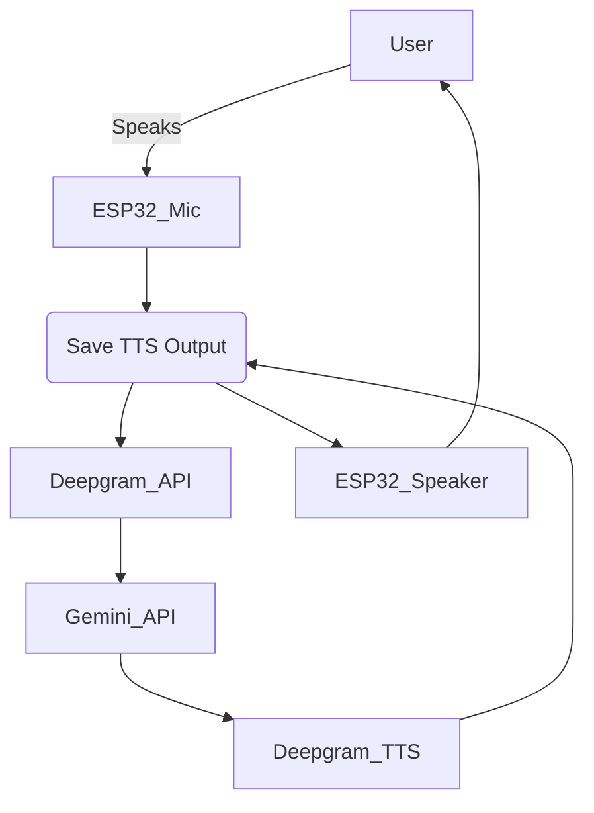

# ESP32 Real-Time Speech-to-Text and Text-to-Speech System with SD Card Support  

This project utilizes the **ESP32** to enable **real-time Text-to-Speech (TTS)** and **Speech-to-Text (STT)** functionalities using **Deepgram** and **Gemini APIs**.  

Additionally, it supports **SD card storage**, allowing voice recordings and conversation logs to be saved for **future playback or analysis**.  

---

## 🚀 Features  
✅ **Real-time Speech-to-Text (STT)**: Converts voice into text using **Deepgram API**.  
✅ **Gemini Integration**: Processes user input and generates intelligent responses.  
✅ **Text-to-Speech (TTS)**: Converts **Gemini responses** into voice using **Deepgram TTS**.  
✅ **ESP32 Support**: Runs efficiently on an **ESP32 microcontroller**.  
✅ **WiFi Connectivity**: Enables communication with APIs over the internet.  
✅ **SD Card Storage**: Saves voice recordings and conversation logs.  
✅ **Low Latency**: Ensures fast response times for real-time conversations.  

---

## 🛠️ Hardware Requirements  
- **ESP32 microcontroller**  
- **Microphone module** (for capturing audio input)  
- **Speaker** (for playing audio output)  
- **MicroSD Card Module** (SPI-based for storage)  
- **MicroSD Card** (FAT32 format, min 8GB recommended)  
- **Power source** (USB or battery)  

---

## 🔧 Software Requirements  
- **Arduino IDE** or **PlatformIO**  
- **ESP32 Board Package**  
- **Deepgram API Key** (for Speech-to-Text)  
- **Gemini API Key** (for AI processing)  
- **WiFi Credentials** (SSID & Password)  
- **SD Card Library for ESP32**  

---

## 📌 Installation & Setup  

### 1️⃣ Clone the Repository  
```sh
git clone https://github.com/KUNAl4216/ESP32-AI-Voice-Assistant.git
cd ESP32-AI-Voice-Assistant
```

### 2️⃣ Install Dependencies  
Ensure you have installed the following libraries in **Arduino IDE** or **PlatformIO**:  
```cpp
#include <ESP32_SD.h>  // For SD card functionality
#include <SPI.h>       // For SD card SPI communication
#include <WiFi.h>      // For internet connectivity
```

### 3️⃣ Configure API Keys & SD Card  
Modify the `config.h` file and add your credentials:  

```cpp
#define WIFI_SSID "YourWiFiName"
#define WIFI_PASSWORD "YourWiFiPassword"
#define DEEPGRAM_API_KEY "YourDeepgramAPIKey"
#define GEMINI_API_KEY "YourGeminiAPIKey"

// Define SD Card CS pin
#define SD_CS 5  // Change to your actual SD card module's CS pin
```

### 4️⃣ Upload Code to ESP32  
- Connect your **ESP32** via **USB**.  
- Select the correct **COM port** in Arduino IDE or PlatformIO.  
- **Compile & upload the code**.  

---

## 📡 How It Works (With SD Card Storage)  
1️⃣ **Voice input** is captured by the microphone.  
2️⃣ The audio is **saved to the SD card** for later playback.  
3️⃣ Audio is sent to **Deepgram API** for **Speech-to-Text conversion**.  
4️⃣ The transcribed text is sent to **Gemini API**, generating a response.  
5️⃣ The response text is sent to **Deepgram TTS** for **Text-to-Speech conversion**.  
6️⃣ The **generated voice output is saved** on the **SD card**.  
7️⃣ The ESP32 **plays the generated audio** through the speaker.  

---

## 🖼️ Project Workflow  



---

## 📂 SD Card File Storage  
| File Name           | Description                                |  
|---------------------|--------------------------------------------|  
| `recording_x.wav`  | Stores recorded user speech (raw audio)    |  
| `response_x.wav`   | Stores Gemini-generated speech (TTS output) |  
| `conversation_log.txt` | Logs full conversation (text format) |  

---

## 📌 Future Enhancements  
✅ **Improve storage efficiency** with compressed audio formats  
✅ **Implement real-time playback** from SD card  
✅ **Add voice recognition** to identify different users  
✅ **Support offline Speech-to-Text & Text-to-Speech models**  
 

🔗 **GitHub**: [ESP32-AI-Voice-Assistant](https://github.com/KUNAl4216/ESP32-AI-Voice-Assistant)  
